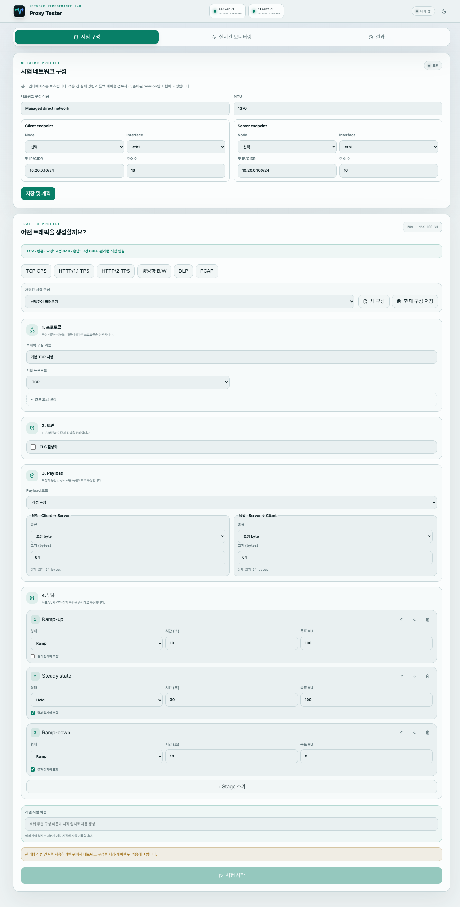
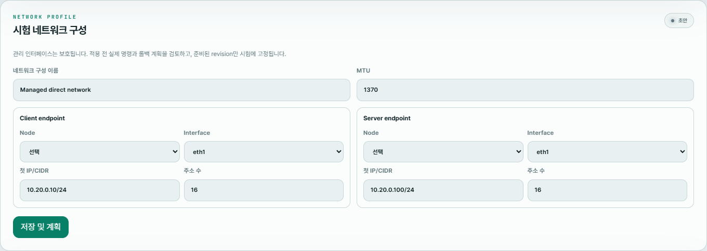
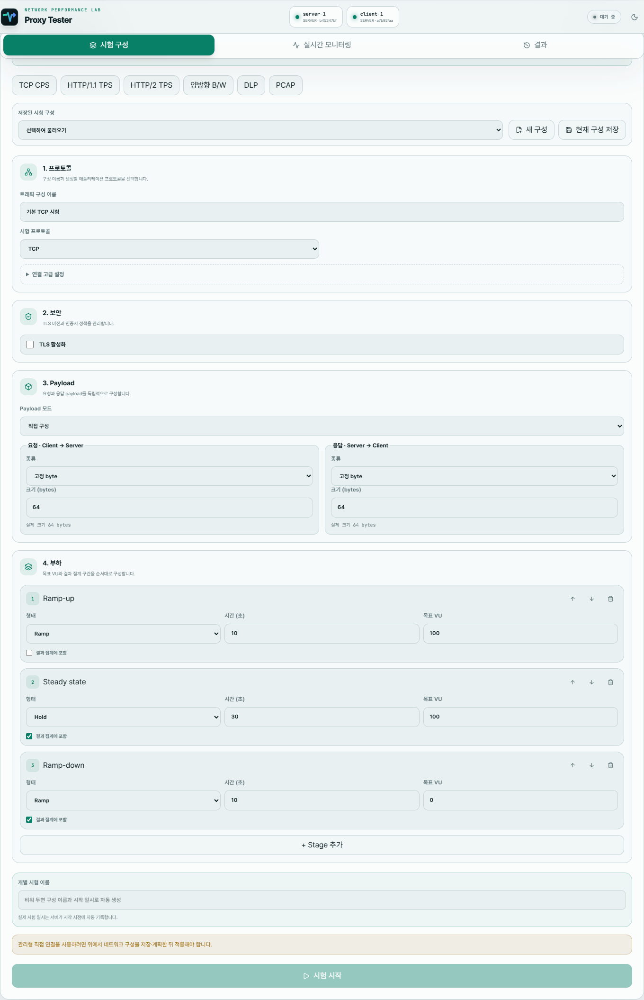

# Proxy Tester

Proxy Tester는 인라인 투명 프록시, passive mirror, 명시적 HTTP Proxy/CONNECT 환경에서 트래픽을 생성하고 성능을 측정하는 도구입니다. TCP CPS·대역폭·PPS와 HTTP TPS를 웹 UI에서 구성하고 확인할 수 있습니다.

Control 서버가 UI, API, SQLite 저장소를 제공하고 여러 Agent가 TCP client 또는 server 역할을 수행합니다. 실제 측정에는 Control 한 대와 측정 경로 양쪽의 Agent가 필요합니다.



## 설치하기

운영 환경에서는 [최신 GitHub Release](https://github.com/yooseongc/proxy-tester/releases/latest)의 네이티브 패키지를 사용하세요. 지원 대상은 x86_64 systemd 기반 Debian 12, Ubuntu 22.04 이상, RHEL/Rocky Linux 9입니다.

배포 파일의 무결성을 먼저 확인합니다.

```bash
sha256sum -c SHA256SUMS
```

### Debian·Ubuntu

Control과 Agent 실행 파일이 함께 설치됩니다. 설치 후 이 장비에서 사용할 구성만 생성합니다.

```bash
sudo apt install ./proxy-tester_0.1.2_amd64.deb

# Control 서버인 경우
sudo proxy-tester-configure control

# Agent 장비인 경우
sudo proxy-tester-configure agent \
  --control-url http://CONTROL_HOST:50051 \
  --node-id node-site-a
```

### RHEL·Rocky Linux

```bash
sudo dnf install ./proxy-tester-0.1.2-1.x86_64.rpm

# Control 서버인 경우
sudo proxy-tester-configure control

# Agent 장비인 경우
sudo proxy-tester-configure agent \
  --control-url http://CONTROL_HOST:50051 \
  --node-id node-site-a
```

### 범용 tar.gz

```bash
tar -xzf proxy-tester-0.1.2-x86_64-linux-musl.tar.gz
cd proxy-tester-0.1.2

# Control 서버인 경우
sudo ./install.sh --component control

# Agent 장비인 경우
sudo ./install.sh --component agent \
  --control-url http://CONTROL_HOST:50051 \
  --node-id node-site-a
```

Agent에 필요한 네트워크 도구까지 apt 또는 dnf로 설치하려면 `--install-deps`를 추가합니다. 한 장비에 두 구성요소가 모두 필요하면 `--component all`을 사용할 수 있습니다.

## 설정하고 시작하기

설치와 업그레이드는 서비스를 자동으로 시작하거나 재시작하지 않습니다. 환경에 맞게 설정 파일을 검토하세요.

- Control: `/etc/proxy-tester/control.env`
- Agent: `/etc/proxy-tester/agent.env`
- Control UI/API 기본 포트: `8080/tcp`
- Agent 연결용 gRPC 기본 포트: `50051/tcp`

필요한 서비스만 시작합니다.

```bash
# Control 서버
sudo systemctl enable --now proxy-tester-control

# Agent 장비
sudo systemctl enable --now proxy-tester-agent
```

브라우저에서 `http://CONTROL_HOST:8080`에 접속합니다. Control의 50051 포트는 Agent가 있는 신뢰된 측정망 또는 VPN에서만 접근하도록 제한하세요.

상태와 로그는 다음 명령으로 확인할 수 있습니다.

```bash
systemctl status proxy-tester-control
systemctl status proxy-tester-agent
journalctl -u proxy-tester-control -f
journalctl -u proxy-tester-agent -f
```

## 첫 시험 구성

### 1. 시험 네트워크 준비



Client와 Server Agent, 전용 시험 인터페이스, IP 대역을 선택합니다. **저장 및 계획**을 누른 뒤 상세 명령과 롤백 계획을 검토하고 Apply와 Diagnose를 완료합니다. 관리 인터페이스를 시험 NIC로 선택하지 마세요.

### 2. 트래픽과 부하 설정



프리셋으로 시작하거나 프로토콜, TLS, 요청·응답 payload와 부하 Stage를 직접 지정합니다. 화면 상단의 한 줄 요약으로 실제 생성될 트래픽을 다시 확인합니다.

### 3. 실행과 결과 확인

**시험 시작**을 누르고 실시간 모니터링에서 CPS/TPS, App·Wire 대역폭, PPS와 오류를 확인합니다. 완료 후 결과 화면에서 Stage별 집계와 오류 상세를 검토하고 JSON 결과가 필요하면 내보냅니다.

인라인과 passive mirror 시험은 도구 관점에서 동일한 직접 Client→Server 트래픽입니다. 브리지, TAP/SPAN과 장비 정책은 외부 환경에서 구성합니다. DLP 탐지·차단 성공 여부는 장비 로그에서 별도로 확인해야 합니다.

자세한 운영 절차는 다음 문서를 참고하세요.

- [설치·업그레이드·제거](docs/INSTALLATION.md)
- [네트워크 구성과 복구](docs/NETWORK_CONFIGURATION.md)
- [Scenario와 payload](docs/SCENARIO_V4.md)
- [계측 지표 해석](docs/TELEMETRY.md)
- [HTTP/2 지원 범위](docs/HTTP2.md)
- [저장소와 백업](docs/STORAGE.md)

## Docker 개발·평가 환경

Docker 구성은 기능 확인과 회귀 시험을 위한 환경이며 운영 성능 측정용 배포 방식이 아닙니다. Docker Desktop 또는 Docker Engine과 Compose가 필요합니다.

저장소를 받은 뒤 루트 디렉터리에서 실행합니다.

```bash
git clone https://github.com/yooseongc/proxy-tester.git
cd proxy-tester
docker compose \
  -f docker/compose.yaml \
  -f docker/compose.managed-direct.yaml \
  up -d --build
```

브라우저에서 `http://localhost:18080`에 접속합니다. 이 구성에는 Control, client Agent, server Agent와 HTTP forward/CONNECT 시험용 proxy fixture가 포함됩니다.

```bash
# 실행 상태
docker compose \
  -f docker/compose.yaml \
  -f docker/compose.managed-direct.yaml \
  ps

# 로그
docker compose \
  -f docker/compose.yaml \
  -f docker/compose.managed-direct.yaml \
  logs -f

# 종료
docker compose \
  -f docker/compose.yaml \
  -f docker/compose.managed-direct.yaml \
  down
```

`down -v`는 Docker 평가 환경의 SQLite 데이터까지 삭제하므로 초기화가 필요한 경우에만 사용하세요. Docker bridge의 제약 때문에 실제 다중 source IP, NIC offload, 고속 PPS 결과는 전용 NIC가 있는 Linux 장비에서 검증해야 합니다.

## 지원 범위

- 프로토콜: TCP, HTTP/1.1, TLS 기반 HTTP/2(h2c 제외)
- 보안: 평문, TLS 1.2/1.3, 인증서 검증 선택
- 경로: 직접 연결, HTTP Proxy, CONNECT
- Payload: empty, fixed, UTF-8 text, artifact file, binary·printable ASCII random
- 재현: 평문 PCAP/PCAPNG에서 추출한 양방향 TCP/HTTP 세션
- 부하: 가상 연결 수, Stage ramp/hold, keep-alive transaction 수

FTP/SMTP, UDP, L2 원본 packet replay, TLS key-log 복호화와 HTTP/3는 현재 지원하지 않습니다. 업로드 한도는 일반 payload 64 MiB, PCAP/PCAPNG 512 MiB입니다.
